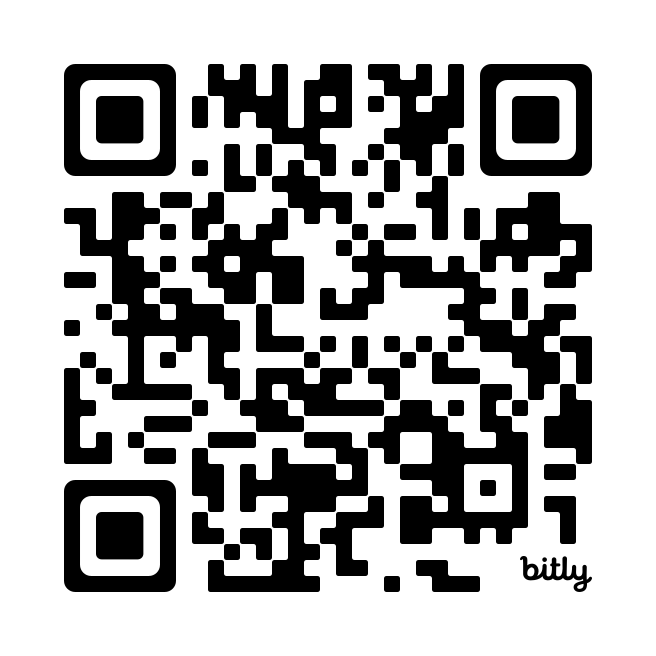
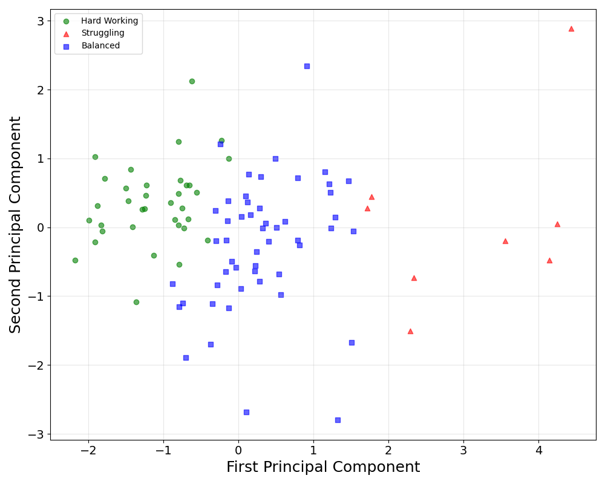
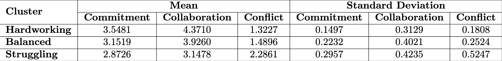

[comment]: # (Compile this presentation with the command below)
[comment]: # (mdslides index.md && mv index/index.html .)
[comment]: # (THEME = night)
[comment]: # (CODE_THEME = base16/zenburn)
[comment]: # (The list of themes is at https://revealjs.com/themes/)
[comment]: # (The list of code themes is at https://highlightjs.org/)
[comment]: # (Pass optional settings to reveal.js:)
[comment]: # (controls: true)
[comment]: # (keyboard: true)
[comment]: # (progress: true)
[comment]: # (width: "1024")
[comment]: # (markdown: { smartypants: true })
[comment]: # (hash: false)
[comment]: # (respondToHashChanges: false)
[comment]: # (Other settings are documented at https://revealjs.com/config/)

### GitDash
#### A Data-Driven Dashboard for Monitoring Team Progress in Software Engineering Education
----------
Rahul Bijoor &amp; Kevin Buffardi

California State University, Chico

</img>

[LearnByFailure.com](https://learnbyfailure.com/)

[LearnByFailure.com](https://learnbyfailure.com/future-software-engineers/)

[comment]: # (!!!)

#### Motivation
----------
**Software Engineering Education**

- Team projects, professional practices
- Need to manage several distinct teams
- How to evaluate fairly for teams and individuals
  - Difficulties at scale
  - Delay in feedback loops

[comment]: # (||| data-auto-animate)

#### Motivation
----------
**Traditional Evalution**

- Peer/Self evaluation
  - Subjective, easy to manipulate
- Tallying contributions (lines of code, commits, etc.)
  - Campbell/Goodhart law: social metrics create perverse metrics

[comment]: # (||| data-auto-animate)

#### Motivation
----------
**Opportunity**

- Need for **automated, real-time** insights into teams
- GitHub provides rich activity data
  - Commits
  - Issues (bug/feature documentation)
  - Pull Requests
  - Code Reviews
  - Comments

[comment]: # (||| data-auto-animate)

#### Motivation
----------
**Opportunity**

- Median contributor's frequency of *any* contribution predicts both **team cohesion** and **lack of conflict** [(Buffardi, et al., 2025)](https://dl.acm.org/doi/abs/10.1145/3724363.3729039)
- Design a dashboard to monitor teams/individuals to identify "teachable moments"

[comment]: # (!!!)

#### Classifying teams
----------
- Post-Hoc analysis
  - **10 years** of undergraduate Software Engineering class
  - [GitHub API](https://docs.github.com/) data
    - **19,095 artifacts** from **94 teams** with **465 unique students**
  - [CATME](https://www.catme.org/) team evaluations

[comment]: # (||| data-auto-animate)

#### Classifying teams
----------

</img>

[comment]: # (||| data-auto-animate)

#### Classifying teams
----------

</img>

[comment]: # (!!!)

#### Dashboard Design
----------
- Analysis motivated dashboard design that combines:
  - GitHub activity (commits, issues, PRs, etc.)
  - Team evaluation (CATME-based) classifications
- Dashboard views:
  - Weekly Activity
  - Team Analysis
  - Member Insights

[comment]: # (||| data-auto-animate)

#### Dashboard Design
----------
- Open source software: [rahulbijoor/GitDash](https://github.com/rahulbijoor/GitDash)
- Demo on [local host](http://localhost:8501/)

[comment]: # (!!!)

#### Limitations
----------
- GitHub activity may not fully represent actual effort (e.g., offline work or non-code contributions)
- Outliers or inactive team members (students who drop off the class) can skew average-based metrics
- Factors other than Collaboration, Commitment, and Conflict influencing team dynamics.

[comment]: # (||| data-auto-animate)

#### Future Work
----------
- Deploy in real class environment to observe the behavioural changes.
- Test other clustering methods/data
- Apply in diverse educational contexts

[comment]: # (!!!)

#### GitDash
----------
<small>This presentation is accessible at [learnbyfailure.com/gitdash-ccsc25/](https://learnbyfailure.com/gitdash-ccsc25/) and its source is available on [GitHub](https://github.com/kbuffardi/gitdash-ccsc25).</small>

<small>Special thanks to [Rahul Bijoor](https://www.linkedin.com/in/rahul-bijoor/) who lead the research and development for this paper while a Masters student at Chico State</small>

</img>

<small>[Back to LearnByFailure](https://learnbyfailure.com/research/)
</small>
